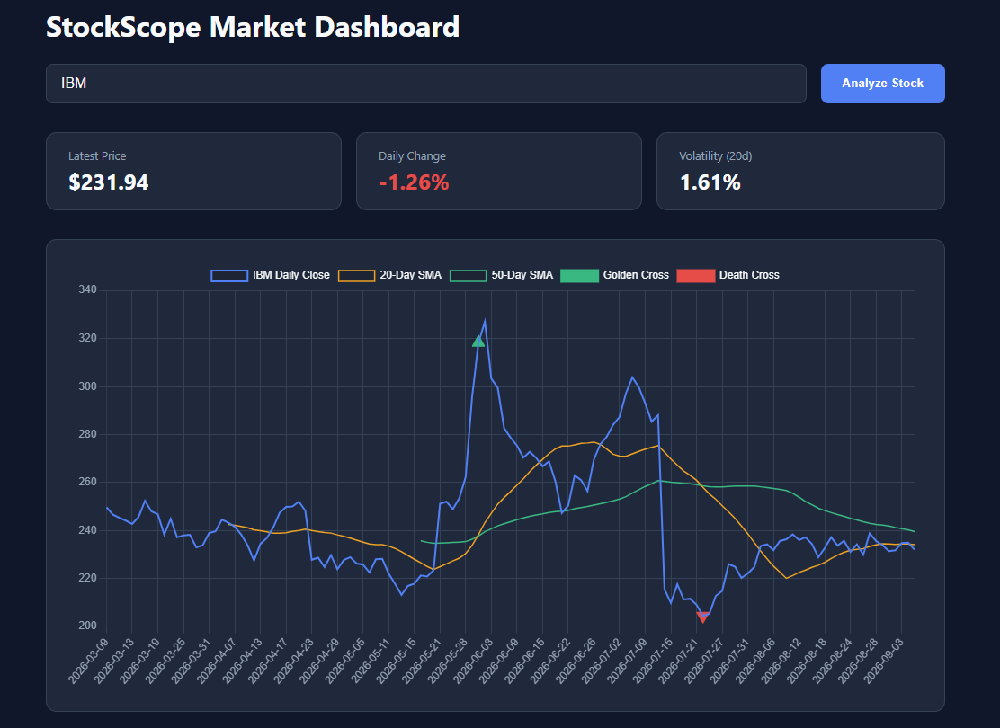

# StockScope

A full-stack stock market dashboard. Enter a ticker, get a live price chart with moving averages, automatic golden/death cross detection, and key stats, all computed server-side and rendered interactively in the browser.

**Live demo:** https://stockscope-uig4.onrender.com
*(Free-tier hosting, so the first load after a period of inactivity may take 20–30 seconds to wake up.)*

 ADD SCREENSHOT AFTER API LIMIT RESET

## What it does

- Enter any US stock ticker and fetch its recent daily price history
- Backend (Flask + pandas) computes:
  - 20-day and 50-day simple moving averages
  - Daily percentage change
  - 20-day rolling volatility
  - Golden cross / death cross detection (moving-average crossover signals)
- Frontend (Chart.js) renders price + moving averages, with crossover points marked directly on the chart, alongside a live stats panel (latest price, daily % change, volatility)
- In-memory caching reduces repeated calls to the data provider for recently-searched tickers
- Backend logic is covered by automated unit tests (pytest)

## Tech stack

- **Backend:** Python, Flask, pandas, requests, python-dotenv
- **Frontend:** HTML, CSS, JavaScript, Chart.js
- **Data source:** Alpha Vantage (free tier)
- **Testing:** pytest
- **Deployment:** Render

## Running it locally

```bash
git clone https://github.com/AzlanL/StockScope.git
cd StockScope
python -m venv venv
venv\Scripts\activate          # Windows
pip install -r requirements.txt
```

Get a free API key from [Alpha Vantage](https://www.alphavantage.co/support/#api-key), then create a `.env` file in the project root:

ALPHA_VANTAGE_KEY=your_key_here

Run it:
```bash
python app.py
```
Then open `http://127.0.0.1:5000` in your browser.

Run the test suite:
```bash
pytest
```

## Known limitations

- Alpha Vantage's free tier is limited to 25 requests/day per API key — the in-memory cache helps, but heavy use can still hit this limit
- The cache resets whenever the server process restarts (e.g. on redeploy, or after Render's free-tier instance sleeps from inactivity)
- US stock tickers only; no cryptocurrency support